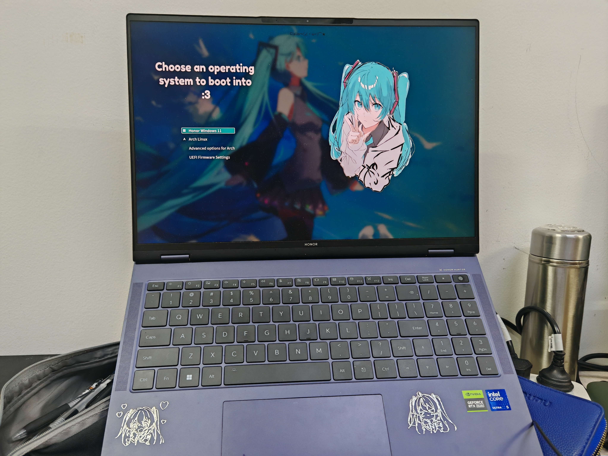

# Hatsune Miku Grub Theme(adapted for 3072x1920 screen!)

A theme of Hatsune Miku for Grub!
adapted for 3072x1920 screen!

Preview：


## Installation
pre :
you need to install JetBrainsMono Nerd Font Mono 
> arch: pacman -S ttf-jetbrains-mono-nerd
1. Download & Unzip

2. Copy `HatsuneMiku` into grub themes directory:

```bash
sudo cp -r HatsuneMiku /usr/share/grub/themes
```

3. Edit `grub` file:

```bash
sudo nano /etc/default/grub
```

4. Change your default theme to HatsuneMiku:

```bash
GRUB_THEME="/usr/share/grub/themes/HatsuneMiku/theme.txt"
```

5. Update grub:

```bash
sudo grub-mkconfig -o /boot/grub/grub.cfg
# or
sudo update-grub
```

6. Reboot the computer
